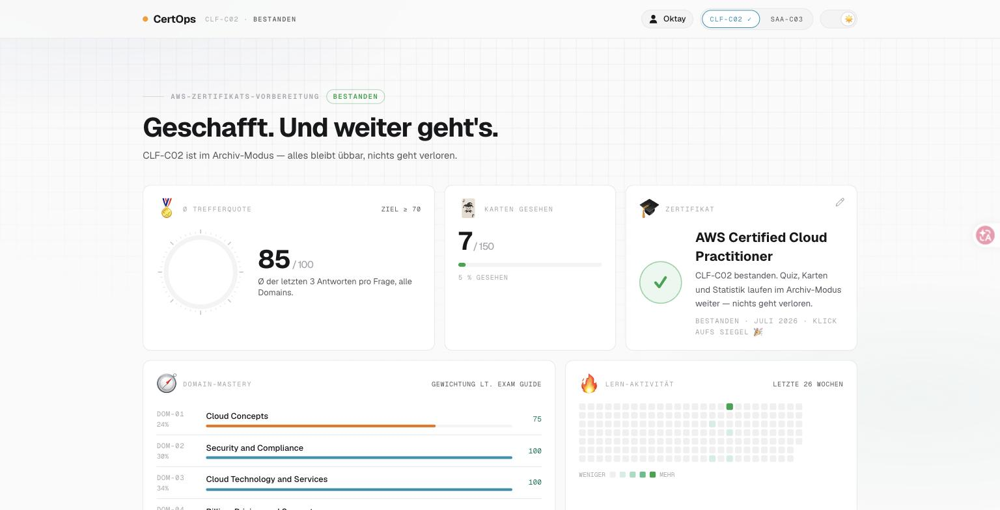
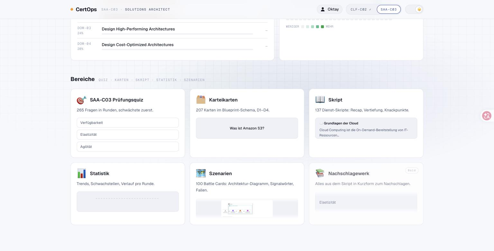
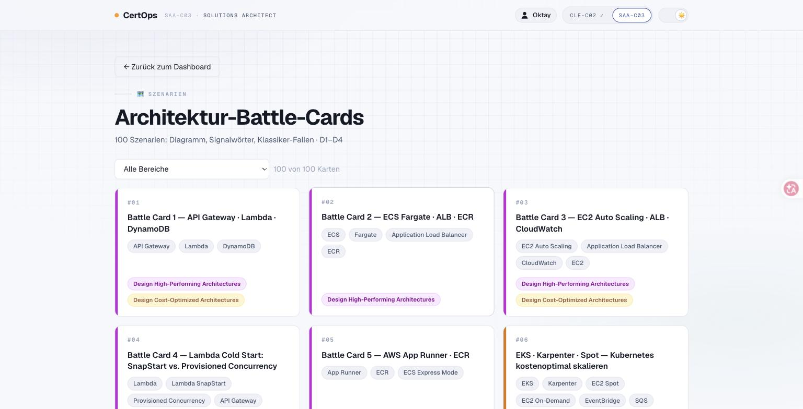
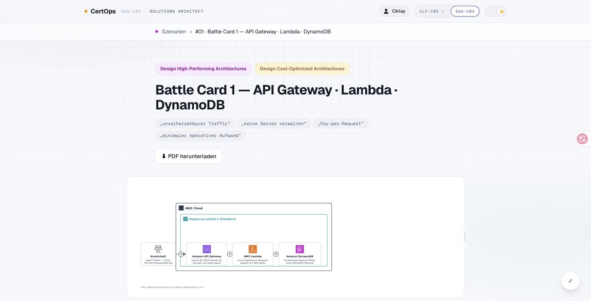
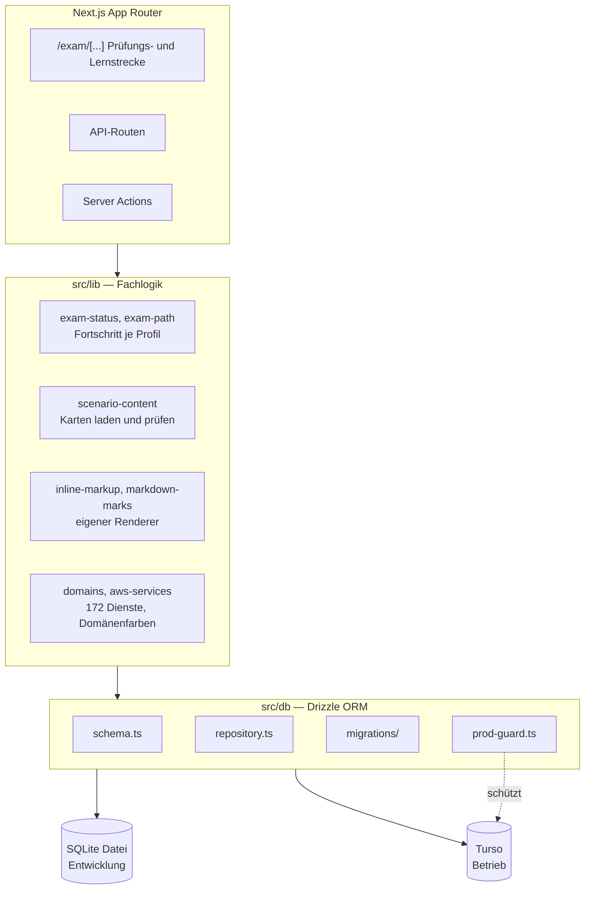

# CertOps

Lernplattform für AWS-Zertifizierungen: Karteikarten, Prüfungssimulation und
Szenario-Karten mit Architekturdiagrammen und ausformulierten Erklärungen.
Ausgelegt auf mehrere Lernprofile mit getrenntem Fortschritt, eigenem
Prüfungsziel und eigenem Branding.

Entstanden aus einem konkreten Bedarf: Vorhandene Lern-Apps prüfen Auswendiglernen
ab. Die AWS-Prüfungen fragen aber Entscheidungen unter Randbedingungen — welcher
Dienst bei welcher Anforderung, und warum nicht der naheliegende. Dafür braucht
es Szenarien statt Vokabeln.

**Live:** [certops-omega.vercel.app](https://certops-omega.vercel.app)



| Bereiche | Szenario-Karten | Karte im Detail |
|---|---|---|
|  |  |  |

## Funktionen

- **Karteikarten** mit strukturierter Rückseite: nicht nur die Antwort, sondern
  die Begründung und die Abgrenzung zu den Alternativen
- **Prüfungssimulation** mit Fortschritt je Profil und Prüfungspfad
- **Szenario-Karten** — pro Karte ein Bündel aus Architekturdiagramm, Kurzkarte,
  strukturierten Daten und narrativer Erklärung
- **Dienste-Katalog** über 172 AWS-Dienste, nach Domänen eingefärbt
- **Fortschritt** als Monatsraster mit Aktivitätsverlauf
- **Mehrere Profile** mit eigenem Prüfungsstatus und eigenem Erscheinungsbild
- **PWA** — installierbar, funktioniert auf dem Telefon

## Aufbau einer Szenario-Karte

Jede Karte ist ein Bündel aus mehreren erzeugten Formaten:

```
public/scenarios/card-70/
  card-070.json        strukturierte Daten der Karte
  card-070.png         Diagramm als Rastergrafik
  card-070.web.svg     Diagramm für den Browser
  card-070.pdf         Druckfassung
  battle_card_70.md    Kurzfassung zum Lernen
  battle_card_70.svg   gesetzte Fassung
  battle_card_70.pdf   Druckfassung
  narrative.md         ausformulierte Erklärung des Szenarios
```

Die Diagramme entstehen über ein eigenes Werkzeug (`tools/diagramkit`) mit den
offiziellen AWS-Architektur-Icons statt handgezeichneter Kästen.

## Architektur



Ein Schema, zwei Ziele: In der Entwicklung läuft eine lokale SQLite-Datei, im
Betrieb dieselben Migrationen gegen Turso. Jedes Datenskript existiert deshalb
doppelt — lokal und `:remote` — und `prod-guard.ts` verhindert, dass ein
lokales Skript versehentlich am Produktivstand landet.

## Qualitätssicherung

53 Testdateien neben dem Code, nicht in einem getrennten Ordner. Die
CI-Strecke läuft bei jedem Pull Request und bei jedem Push auf `main`:

| Schritt | Zweck |
|---|---|
| `pnpm lint` | ESLint |
| `pnpm typecheck` | `tsc --noEmit` |
| `pnpm test:run` | Vitest |
| `pnpm db:migrate` | erzeugt eine schemaseitige Datenbank ohne Daten |
| `pnpm build` | Produktionsbau |

Der Migrationsschritt ist nötig, weil der Bau Seiten statisch rendert und dabei
die Datenbank liest. Er bekommt deshalb ein leeres Schema — und ausdrücklich
keine echten Zugangsdaten. Die Rechte des CI-Laufs sind auf `contents: read`
begrenzt, der Job-Name ist als Statuscheck des Branch-Schutzes festgeschrieben.

## Entwicklung

```bash
pnpm install
cp .env.local.example .env.local
pnpm db:migrate                # legt data/certops.db an
pnpm db:seed                   # Beispieldaten
pnpm dev                       # http://localhost:3002
```

Zugangsdaten für den Betrieb liegen in einer separaten `.env.turso`, die
ausschließlich von den `:remote`-Skripten gelesen wird. Sie ist nicht
versioniert und war es nie.

## Stack

Next.js (App Router, Server Actions) · React · TypeScript · Drizzle ORM ·
SQLite / Turso (libSQL) · Vitest · pnpm · GitHub Actions · Vercel

## Projektdokumentation

Unter `docs/` liegen Spezifikationen und Übergabedokumente. Sie sind
absichtlich ehrlich gehalten: Wo ein Abschnitt noch nicht übertragen ist,
steht ein sichtbarer Platzhalter statt eines rekonstruierten Textes. Eine
erfundene Spezifikation, die aussieht wie die echte, richtet mehr Schaden an
als eine sichtbare Lücke.

## Drittanbieter

Siehe [NOTICE](NOTICE). Die AWS-Architektur-Icons stammen aus dem offiziellen
Asset-Paket von Amazon Web Services und unterliegen deren Nutzungsbedingungen.
AWS ist eine Marke von Amazon.com, Inc. Dieses Projekt steht in keiner
Verbindung zu Amazon Web Services.
